# HotelHigh5
Online booking applicaton. 
The final task of the PROGmasters education is to create a demo project in an agile team (with product owner, scrum master, manual tester and developers).  
**Vision:** Creating a collection website for accommodation providers in Budapest, where tourists arriving in Budapest can easily and quickly book accommodation. 
**Mission:** We want to give a market opportunity to smaller accommodation providers who do not understand or do not have the right IT background and expertise. 
**Values:** We believe that with the help of technology, we provide an opportunity in technology catching up and market opportunities for less innovative or more IT backward accommodation providers. 

## Short description
The application contains detailed information about 50 hotels and their rooms, which was collected with a web crawler application. It also contains more than a thousand generated room reservations.
The guest looking for accommodation can search among the hotels according to free time and different conditions. And you can book more than one room at a time. Not to search, but registration is required to make a reservation.
The hotel owner can register a hotel and edit its data and room data. You can list room reservations and view them graphically. In the graphical interface it is also possible to modify, cancel reservations and create a new room reservation. You can also request statistics on bookings compared to the given period of the previous year.

## Technologies used
`Java11` `Spring Boot` `MySQL` `JPA` `Hibernate` `JUnit` `HTML/CSS` `Bootstrap` `JavaScript` `TypeScript` `Angular` `Material` `Selenium` `AWS` `GitLab Runner` `Postman`

## Entity Relationship Diagram

## Screen captures
**Homepage**
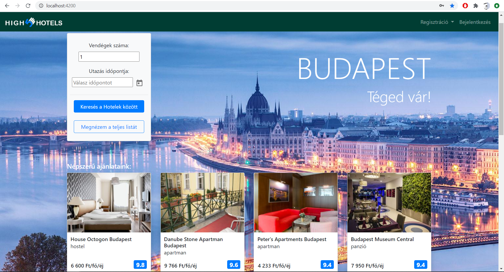

**Hotel list page**
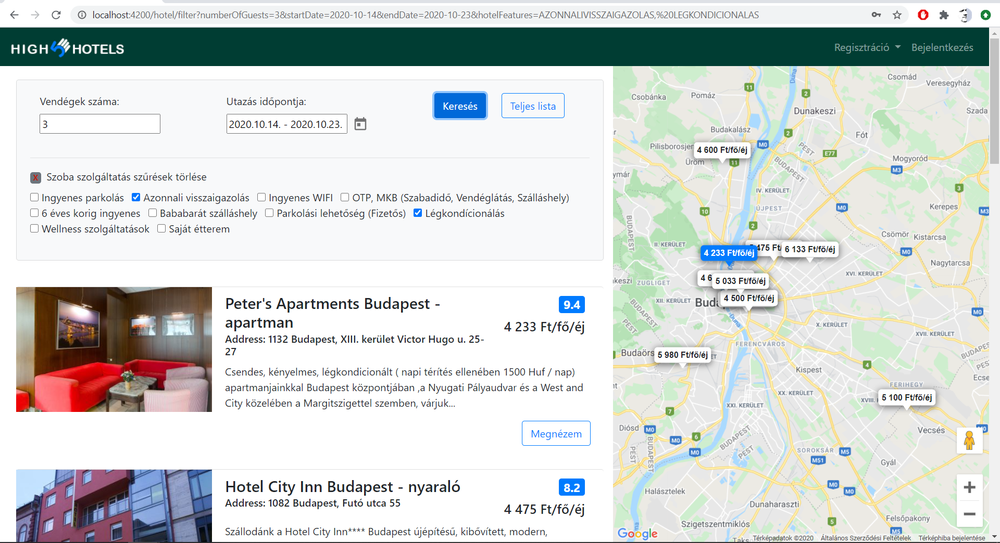

**Hotel detail (rooms) page**
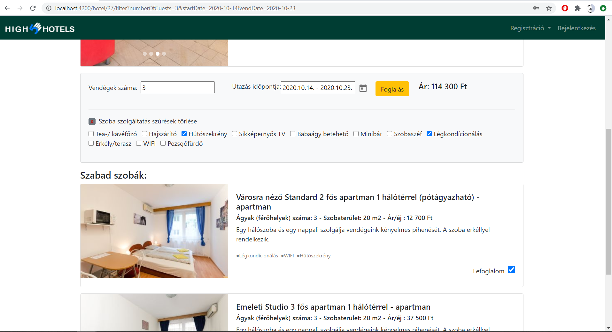

**Login page (before booking)**
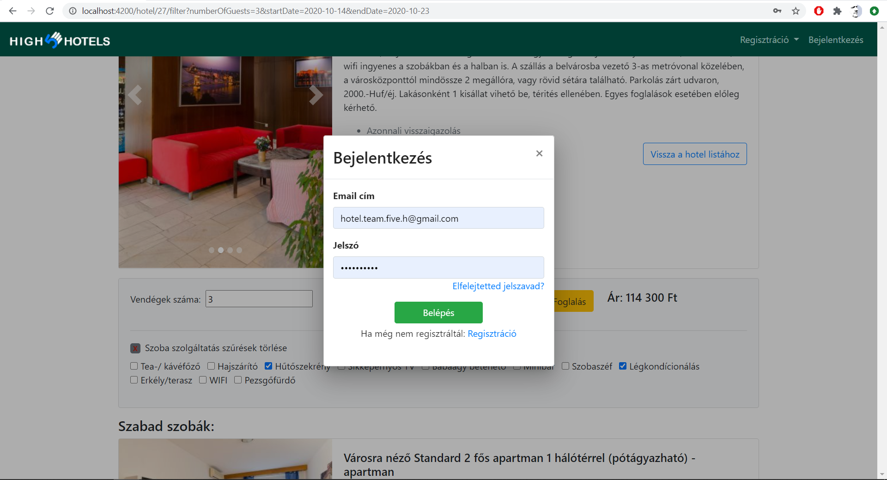

**Booking page**
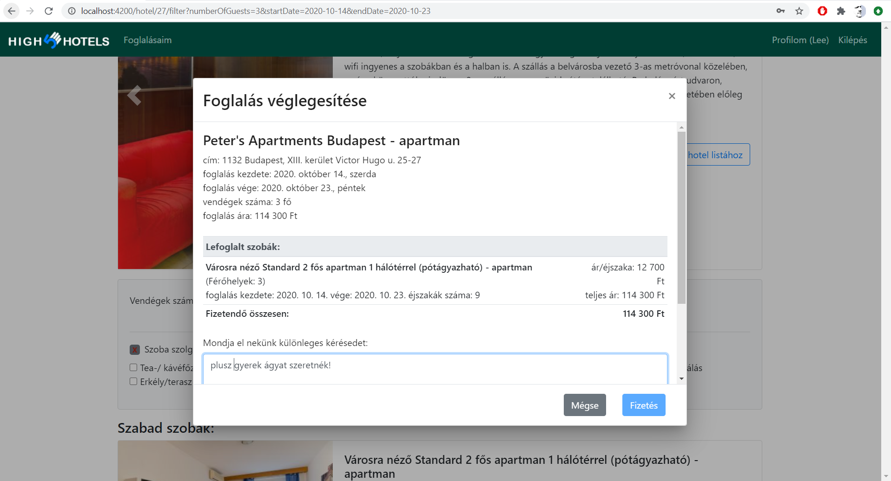

**Booking confirmation page**
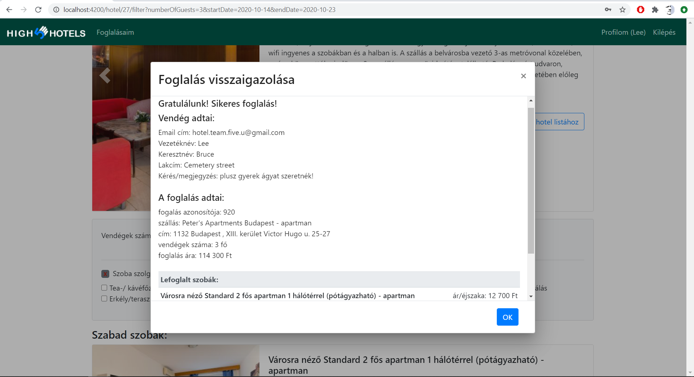

**Hotel booking list (for hotel owner)**
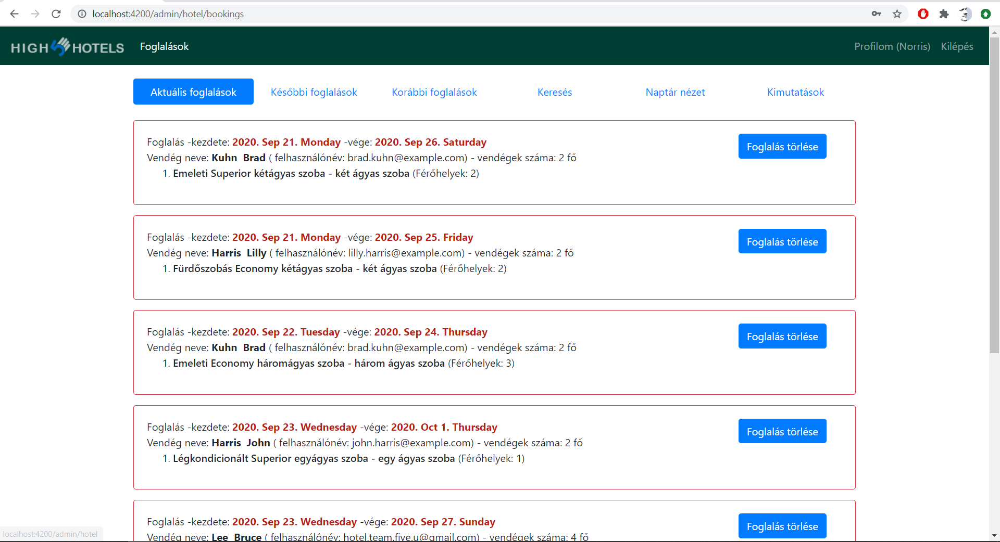

**Hotel booking details (for hotel owner)**
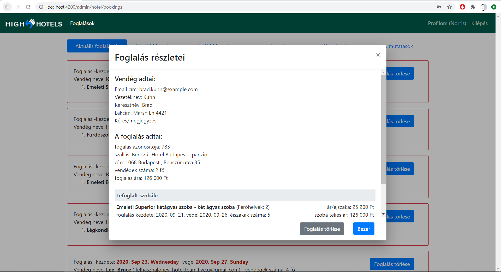

**Hotel booking calendarview (for hotel owner)**
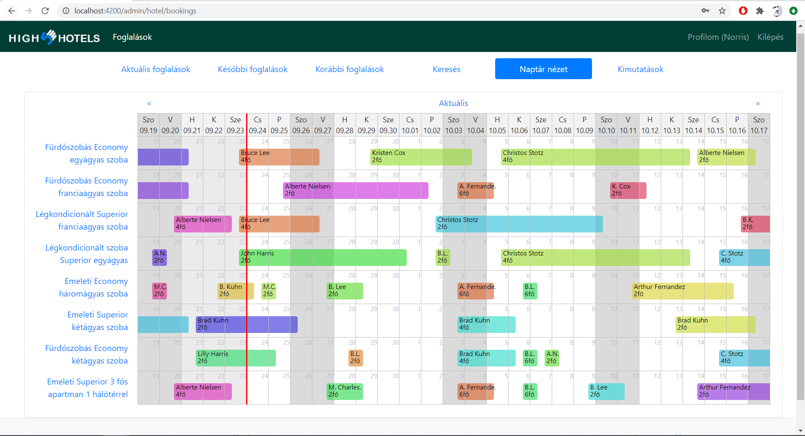

**Hotel booking calendarview / add booking (for hotel owner)**
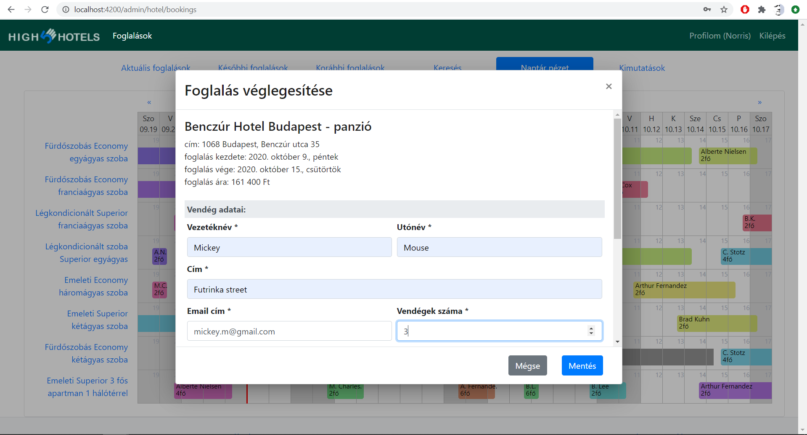

**Hotel booking statistics (for hotel owner)**
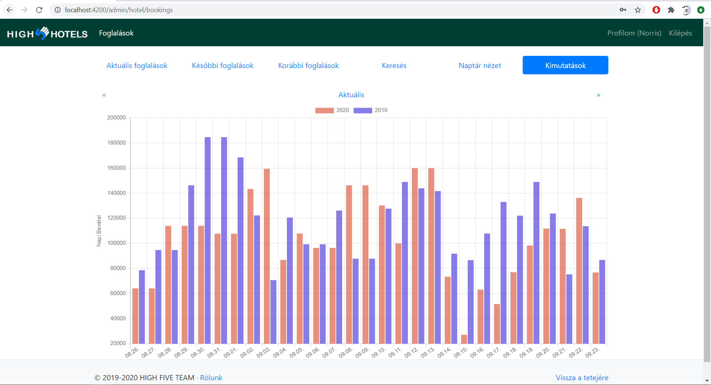
